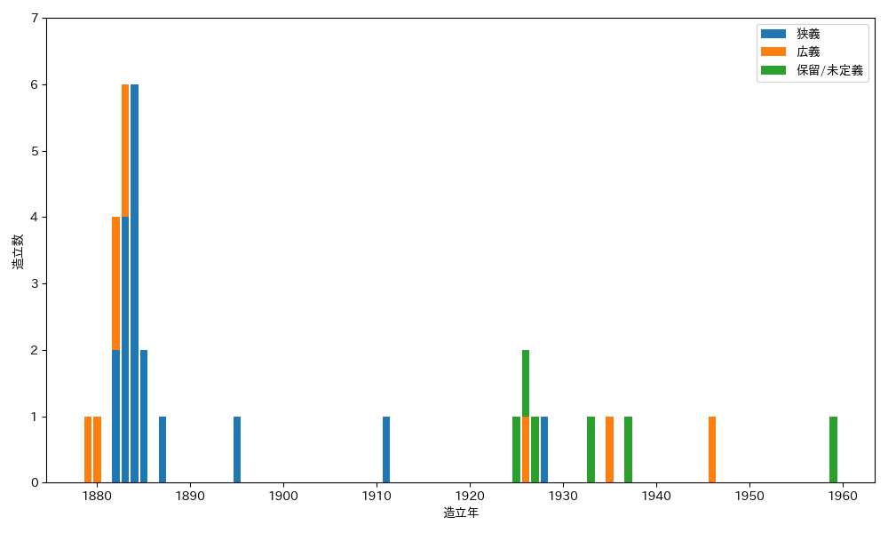

# 妙法守護碑リスト

### 分類
* 狭義 - 清正光※1の信仰者によって造立され、「妙法(守護)」を主銘文に含み、「金神 水神」※3を伴う信仰碑※4
* 広義 - 清正光※1の信仰者によって造立され、「妙法(守護)」を主銘文に含む信仰碑※4
* 保留 - 主銘文に「妙法(守護)」を含むが、清正光※1との関連が不明確な信仰碑  
* 未定義 - 主銘文に「妙法(守護)」を含まないが、「日天 月天」※2「金神 水神」※3のどちらかを伴い、清正光※1との関連が疑われる信仰碑

※1 清正光の流れをくむ妙法加藤明神を含む  
※2 「日天 月天」はどちらか単独ではなく、組になっていること  
※3 「金神 水神」はどちらか単独ではなく、組になっていること  
※4 「南無妙法蓮華経」と刻まれた題目塔は除く

### 造立数

### 分布
狭義と広義の妙法守護碑（保留と未定義は除く）の

### 年表
#### 妙法守護碑（狭義／広義）
<table>
  <tr><th rowspan="3">造立年</th><th colspan="2">金神水神あり</th><th colspan="2">金神のみ</th><th colspan="2">金神水神なし</th></tr>
  <tr><th>日天月天あり</th><th>日天月天なし</th><th>日天月天あり</th><th>日天月天なし</th><th>日天月天あり</th><th>日天月天なし</th></tr>
  <tr><th colspan="2">狭義</th><th colspan="4">広義</th></tr>
  <tr>
    <td>明治12年</td>
    <td></td>
    <td></td>
    <td></td>
    <td></td>
    <td></td>
    <td></td>
  </tr>
  <tr>
    <td>明治13年</td>
    <td></td>
    <td></td>
    <td></td>
    <td></td>
    <td></td>
    <td></td>
  </tr>
  <tr>
    <td>明治15年</td>
    <td></td>
    <td></td></td>
    <td></td>
    <td></td>
    <td></td>
    <td> 
        </td>
  </tr>
  <tr>
    <td>明治16年</td>
    <td> 
        </td>
    <td></td>
    <td></td>
    <td></td>
    <td></td>
    <td></td>
  </tr>
  <tr>
    <td>明治17年</td>
    <td></td>
    <td></td>
    <td></td>
    <td></td>
    <td></td>
    <td></td>
  </tr>
  <tr>
    <td>明治18年</td>
    <td></td>
    <td></td>
    <td></td>
    <td></td>
    <td></td>
    <td></td>
  </tr>
  <tr>
    <td>明治20年</td>
    <td></td>
    <td></td>
    <td></td>
    <td></td>
    <td></td>
    <td></td>
  </tr>
  <tr>
    <td>明治28年</td>
    <td></td>
    <td></td>
    <td></td>
    <td></td>
    <td></td>
    <td></td>
  </tr>
  <tr>
    <td>明治44年</td>
    <td></td>
    <td></td>
    <td></td>
    <td></td>
    <td></td>
    <td></td>
  </tr>
  <tr>
    <td>大正15年</td>
    <td></td>
    <td></td>
    <td></td>
    <td></td>
    <td></td>
    <td></td>
  </tr>
  <tr>
    <td>昭和3年</td>
    <td></td>
    <td></td>
    <td></td>
    <td></td>
    <td></td>
    <td></td>
  </tr>
  <tr>
    <td>昭和10年</td>
    <td></td>
    <td></td>
    <td></td>
    <td></td>
    <td></td>
    <td></td>
  </tr>
  <tr>
    <td>昭和21年</td>
    <td></td>
    <td></td>
    <td></td>
    <td></td>
    <td></td>
    <td></td>
  </tr>
  <tr>
    <td>昭和24年</td>
    <td></td>
    <td></td>
    <td></td>
    <td></td>
    <td></td>
    <td></td>
  </tr>
  <tr>
    <td>不明</td>
    <td></td>
    <td></td>
    <td></td>
    <td></td>
    <td></td>
    <td></td>
  </tr>
</table>

#### 未定義（「妙法」なし）
<table>
  <tr><th rowspan="2">造立年</th><th colspan="3">日天月天あり</th><th>日天月天なし</th></tr>
  <tr><th>金神水神あり</th><th>金神のみ</th><th>金神水神なし</th><th>金神水神あり</th></tr>
  <tr>
    <td>大正14年</td>
    <td></td>
    <td></td>
    <td></td>
    <td></td>
  </tr>
  <tr>
    <td>大正15年</td>
    <td></td>
    <td></td>
    <td></td>
    <td></td>
  </tr>
  <tr>
    <td>昭和2年</td>
    <td></td>
    <td></td>
    <td></td>
    <td></td>
  </tr>
  <tr>
    <td>昭和8年</td>
    <td></td>
    <td></td>
    <td></td>
    <td></td>
  </tr>
  <tr>
    <td>不明</td>
    <td></td>
    <td></td>
    <td></td>
    <td></td>
  </tr>
</table>

### 参考文献
小池隆[「妙法守護碑」](https://researchmap.jp/tk01k/published_papers/50023106)2025年
